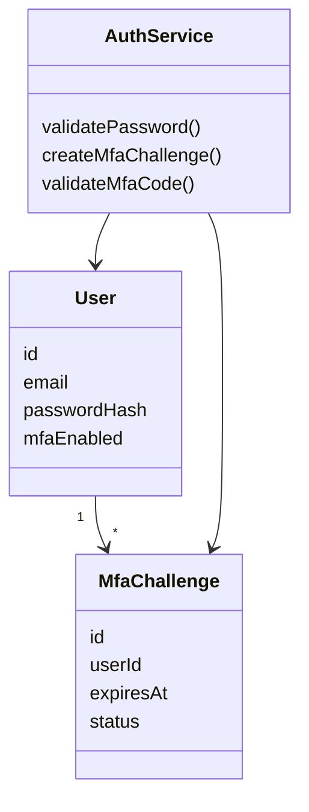

# Diagrama de clases MFA v1.0.0

```mermaid
classDiagram
  class User {
    id
    email
    passwordHash
    mfaEnabled
  }
  class MfaChallenge {
    id
    userId
    expiresAt
    status
  }
  class AuthService {
    validatePassword()
    createMfaChallenge()
    validateMfaCode()
  }
  User "1" --> "*" MfaChallenge
  AuthService --> User
  AuthService --> MfaChallenge
```
