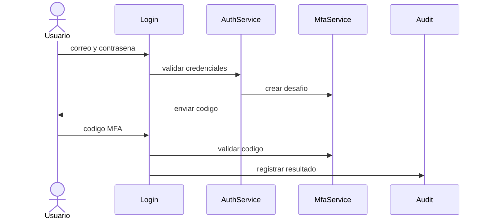

# Diagrama de secuencia MFA v1.0.0

```mermaid
sequenceDiagram
  actor Usuario
  participant Login
  participant AuthService
  participant MfaService
  participant Audit
  Usuario->>Login: correo y contrasena
  Login->>AuthService: validar credenciales
  AuthService->>MfaService: crear desafio
  MfaService-->>Usuario: enviar codigo
  Usuario->>Login: codigo MFA
  Login->>MfaService: validar codigo
  Login->>Audit: registrar resultado
```
